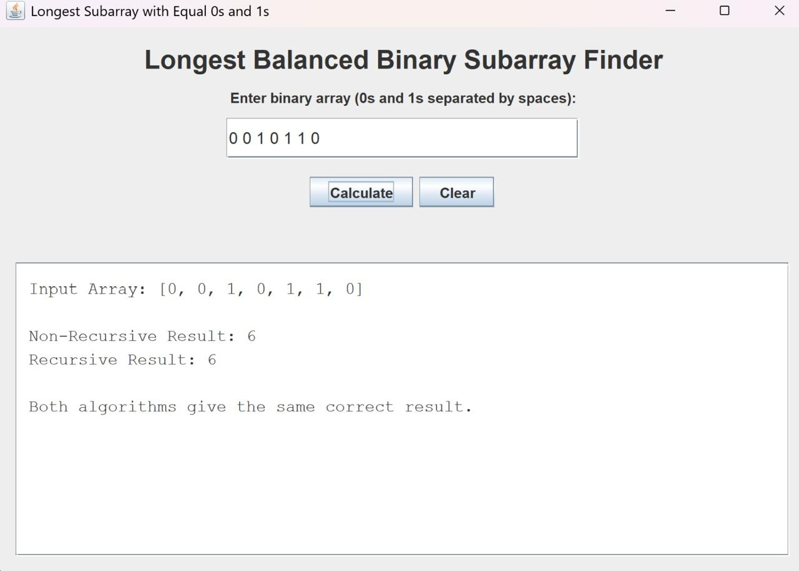
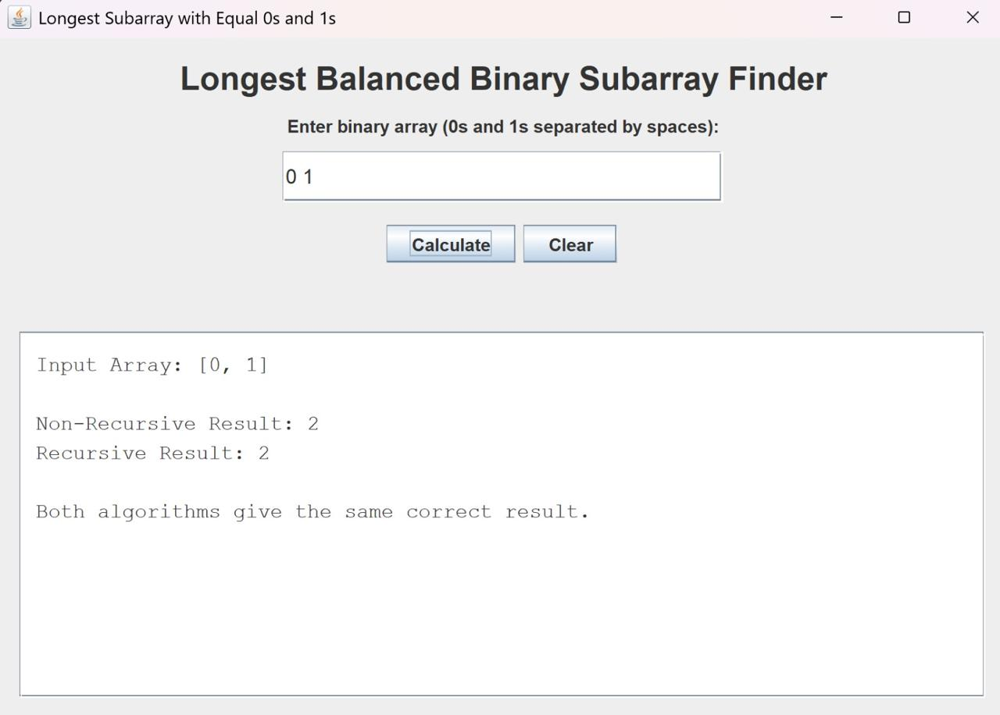
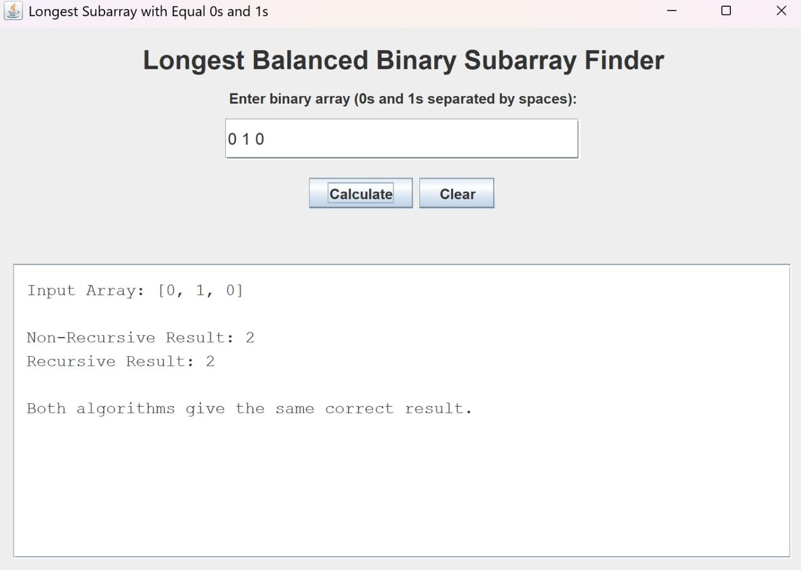
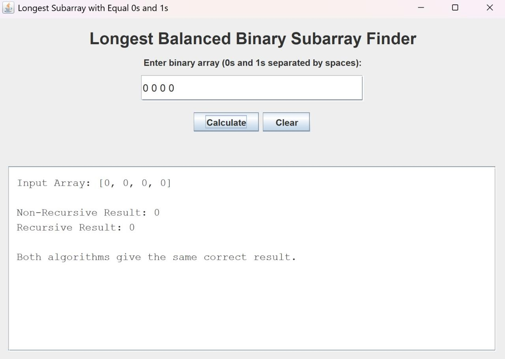
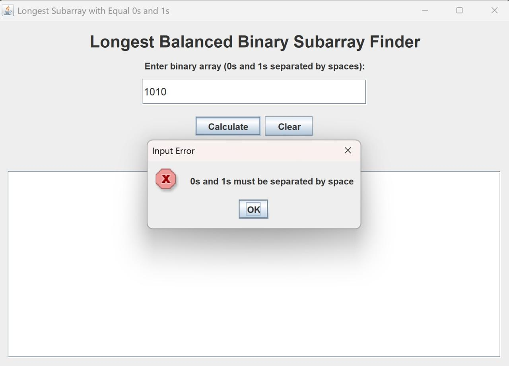
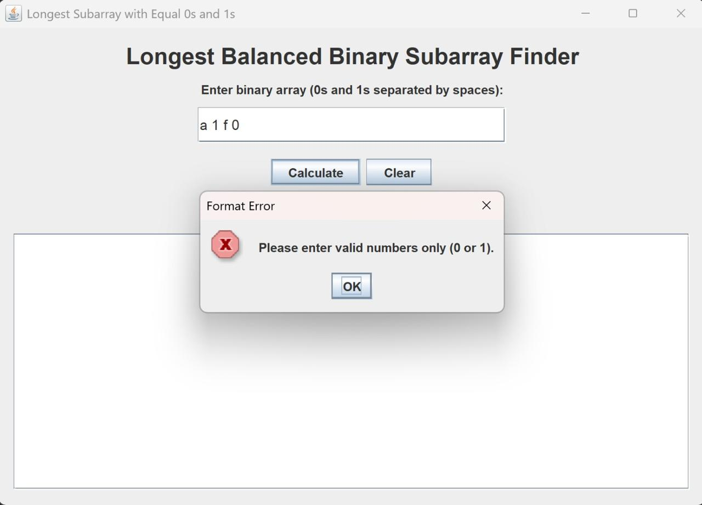
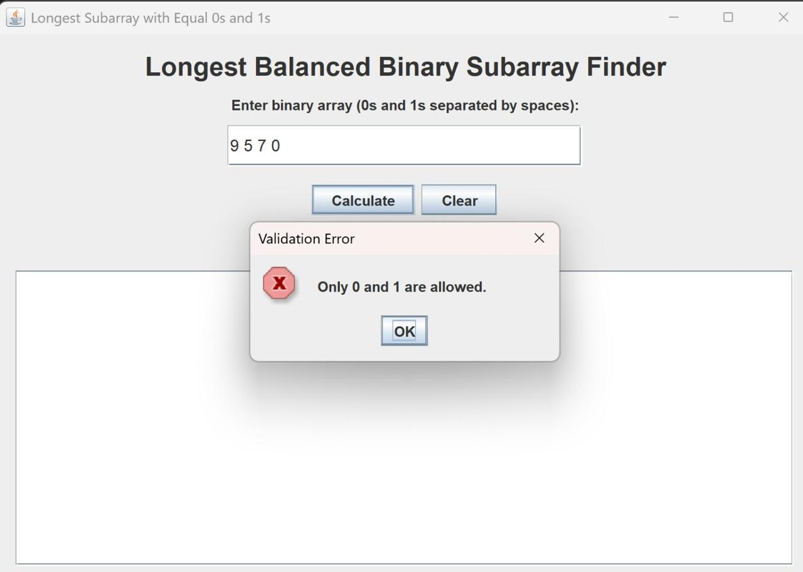
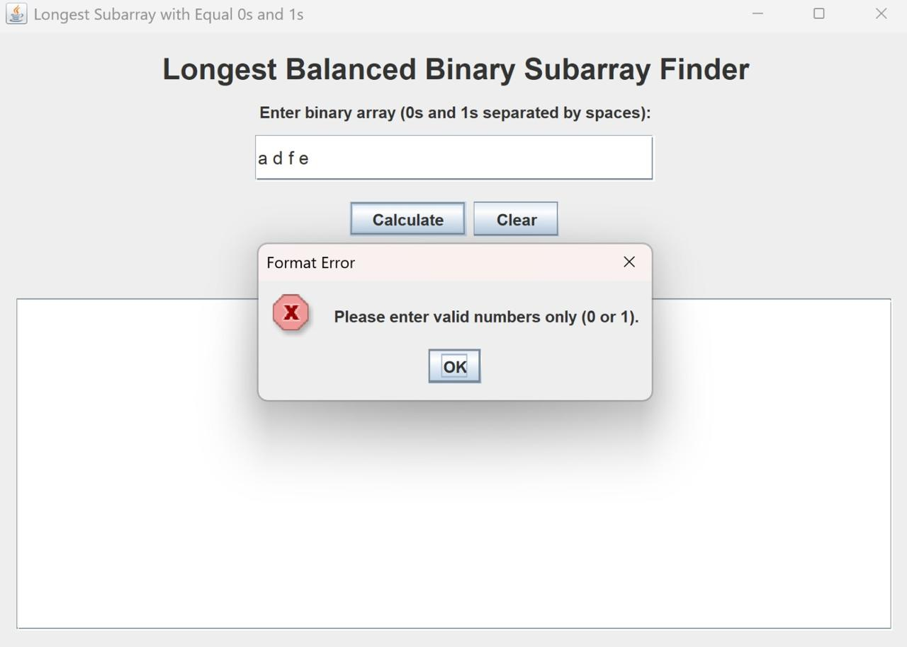

<div align="center">

# 🔢 Longest Balanced Binary Subarray Finder

**A Java Swing desktop app that finds the longest contiguous subarray with an equal number of `0`s and `1`s.**




</div>

---

## 📖 Overview

**Longest Balanced Binary Subarray Finder** is a lightweight Java Swing desktop application that solves a classic array problem: given a binary array (only `0`s and `1`s), find the length of the **longest contiguous subarray** containing an equal number of `0`s and `1`s.

The app runs **two implementations side by side** so results can be cross-checked instantly:

| 🔁 Non-recursive | ♻️ Recursive |
| :---: | :---: |
| Iterative prefix-sum approach | Recursive prefix-sum approach |

---

## ✨ Features

- 🖥️ Simple, intuitive Java Swing graphical interface
- ⌨️ Space-separated binary array input
- ⚖️ Side-by-side comparison of recursive vs. non-recursive results
- ⚠️ Clear, descriptive validation messages for invalid input
- 🧾 Clean output panel showing the parsed array and final result

---

## 🧠 Algorithm Idea

The core trick: treat each `0` as `-1` and each `1` as `+1`, then track running prefix sums.

> When the **same prefix sum appears twice**, the elements between those two indices must contain an equal number of `0`s and `1`s. The **maximum distance** between two indices sharing a prefix sum gives the longest balanced subarray length.

---

## ⏱️ Complexity

| Approach | Time Complexity | Space Complexity |
| :--- | :---: | :---: |
| Non-recursive | `O(n)` | `O(n)` |
| Recursive | `O(n)` | `O(n)` |

---

## 📁 Project Structure

```text
.
├── src/
│   ├── LongestBalancedSubarray.java
│   └── LongestBalancedSubarrayGUI.java
├── screenshots/
└── README.md
```

---

## 🚀 Run Locally

**1. Compile the project**
```bash
javac src/*.java
```

**2. Run the GUI**
```bash
java -cp src LongestBalancedSubarrayGUI
```

---

## 🧪 Example Inputs

```text
0 1
0 1 0
0 0 1 0 1 1 0
0 0 0 0
```

---

## 🖼️ Screenshots

### ✅ Valid Results

<table align="center">
  <tr>
    <td align="center">
      <br>
      <sub>Balanced input → result <b>2</b></sub>
    </td>
    <td align="center">
      <br>
      <sub>Short array → result <b>2</b></sub>
    </td>
  </tr>
  <tr>
    <td align="center">
      <br>
      <sub>Long array → result <b>6</b></sub>
    </td>
    <td align="center">
      <br>
      <sub>All zeroes → result <b>0</b></sub>
    </td>
  </tr>
</table>

### 🚫 Input Validation

<table align="center">
  <tr>
    <td align="center">
      <br>
      <sub>Spacing error</sub>
    </td>
    <td align="center">
      <br>
      <sub>Invalid format</sub>
    </td>
  </tr>
  <tr>
    <td align="center">
      <br>
      <sub>Only 0/1 allowed</sub>
    </td>
    <td align="center">
      <br>
      <sub>Letter input error</sub>
    </td>
  </tr>
</table>

---

## 👤 Contributor

Created with ❤️ by **[`malakmohamed217`](https://github.com/malakmohamed217)**

---

<div align="center">
<sub>If you found this project useful, consider giving it a ⭐!</sub>
</div>
